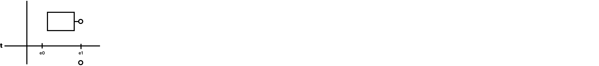
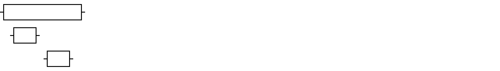
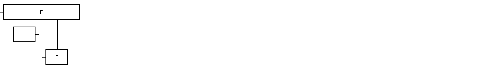

# Flow-Oriented Programming

This repository presents a conceptual framework for **Flow-Oriented Programming (FOP)**. The idea is to represent execution flows as a combination of **data** and **functions**, where functions manipulate data through defined addresses. Below, we detail the key components of FOP, with visual representations for each concept.

---

## How It Works

Flow-Oriented Programming encourages thinking about computation in terms of flows between data and functions. Functions are abstract units that can modify the state by interacting with data through specific addresses, which can be concrete or abstract. These concepts can be arranged into **layers** that create the **context** for a particular execution flow. A flow of execution completes when the context is fully realized.

## Visualizations

The images in this repository help visualize each of the concepts in **Flow-Oriented Programming**, showing how data and functions interact within different layers and contexts.


---

## Concepts

### 1. A flow of execution consists of data and functions.  


```javascript
    const a;
    function f(context){}
```

```javascript
    const a;
    function f(context){}
```

---

### 2. Data is a unit of information.  


---

### 3. A state can have n data.  


```javascript
   const a, b;
```

```javascript
   const a;
   const b;
```
---

### 4. A function is a unit of state change.  


```javascript
  function f(context){
     return "a";
   }
```
---

### 5. A function can have n input addresses and n output addresses.  


```javascript
   function f(context) { }

   function f(context) {
     const { a } = context;
   }

   function f(context) {
     const { a } = context;

     return a;
   }

   function f(context) {
     return;
   }

   function f(context) {
     const { a, b, c } = context;

     return { a, b, c };
   }
```

---

### 6. Functions and data can have concrete addresses.  


---

### 7. Functions and data can have abstract addresses.  


---

### 8. A function can receive abstract addresses of data and functions as input.  


```javascript
  function f(context) {
     const { a } = context;
   }

   function f(context) {
     const { f1 } = context;
   }
```

---

### 9. A function can return concrete addresses of data and functions as output.  


```javascript
  function f(context) {
     return "";
   }

   function f(context) {
     return function () { }
   }
```

---

### 10. Functions can contain other sequential functions.  


```javascript
   async function f(context) {
     await f1({ ...context });
     await f2({ ...context });
   }
```

---

### 11. Functions can contain other parallel functions.  


```javascript
  async function f(context) {
     await Promise.all([
       f1({ ...context }),
       f2({ ...context }),
     ]);
   }
```

---

### 12. Functions can contain selection structures.  


```javascript
   async function f(context) {
     const a = await f1({ ...context });

     if (a) {
       await f2({ ...context, a });
     }
   }
```

---

### 13. Functions can have loop structures.  


```javascript
   async function f(context) {
     const { a } = context;

     const a = await f1({ ...context });

     await f({ ...context, a });
   }
```

---

### 14. Addresses that know each other are part of the same layer.  


```javascript

   import f1 from './f1';
   import f2 from './f2’;
   import a  from './a';

   export default async function f(context) {
     const [b, c] = await Promise.all([
       f1({ ...context, a }),
       f2({ ...context, a }),
     ]);

     if (b && c) {
        return f({ ...context, a });
     }

     return c;
   }
 
```

---

### 15. Addresses that do not know each other are in different layers.  


```javascript
   import f1 from './f1';
  
   export default async function f(context) {
     const { a, f2 } = context;

     const [b, c] = await Promise.all([
       f1({ ...context, a }),
       f2({ ...context, a }),
     ]);

     if (b && c) {
        return f({ ...context, a, f2 });
     }

     return c;
   }

```

---

### 16. Every input forms a layer.  


---

### 17. A layer is a replaceable unit.  


---

### 18. Different layers form a context.  


---

### 19. The flow execution occurs when the context is complete.  


```javascript
  import f1 from './f1';

   await f({
     a: '',
     f2: () => {}
   });
  
   export default async function f(context) {
     const { a, f2 } = context;

     const [b, c] = await Promise.all([
       f1({ ...context, a }),
       f2({ ...context, a }),
     ]);

     if (b && c) {
        return f({ ...context, a, f2 });
     }

     return c;
   }
```
---

## Contributing

Feel free to contribute! If you have suggestions, bug fixes, or improvements, please follow these steps:

1. Fork the repository.
2. Create a new branch (`git checkout -b feature-branch`).
3. Commit your changes (`git commit -am 'Add new feature'`).
4. Push to the branch (`git push origin feature-branch`).
5. Open a Pull Request.

## License

This project is licensed under the MIT License - see the [LICENSE](LICENSE) file for details.

---

## Contact

For any questions or suggestions, please open an issue or contact us via [laerciogermanoo@gmail.com](mailto:laerciogermanoo@gmail.com).
