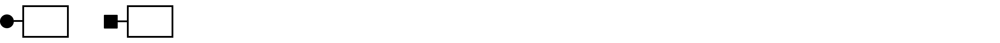
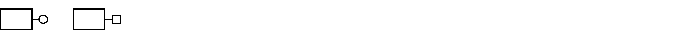
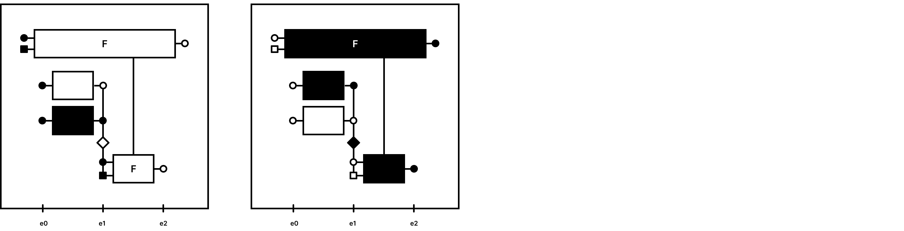
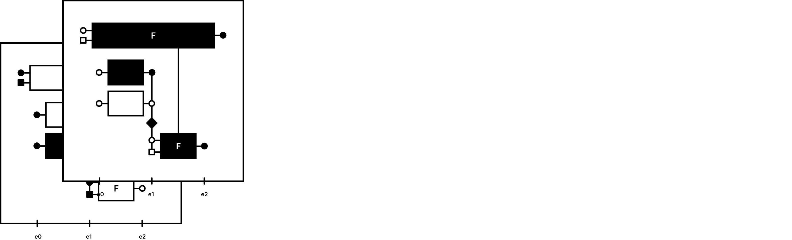
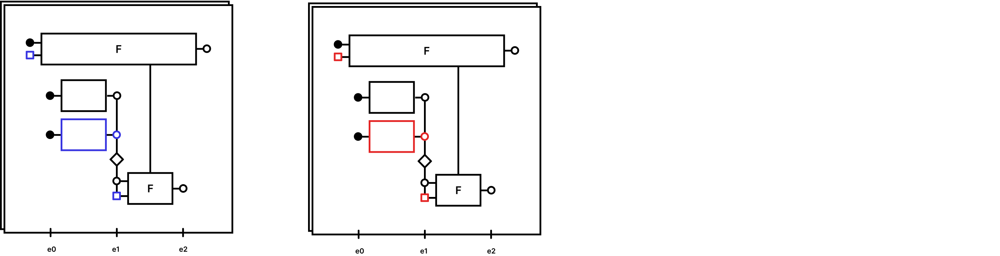
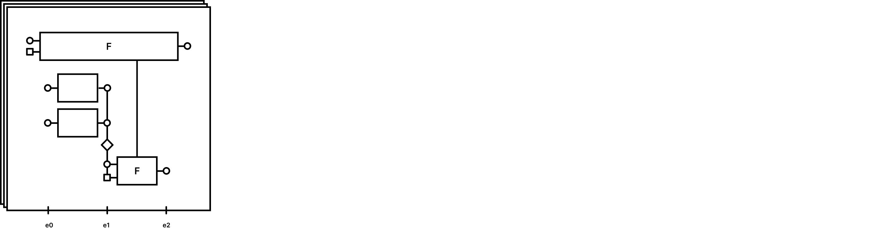

# Flow-Oriented Programming

*"Nothing is permanent, except change." – Heraclitus, c. 535 – c. 475 BCE*

This repository introduces the conceptual framework of **Flow**, a visual paradigm for **service-oriented** development. Flow emphasizes **service-level** decoupling in **all calls**, ensuring increased compatibility and making every component a **replaceable layer**. By **eliminating redundant concepts** and adopting a **one way of development approach**. Flow leverages an innovative **layered architecture** with **ubiquitous language** and **concrete visual representations**, fostering **clarity** and **maintainability** in **software design**. While initially designed for software, the principles of Flow are **applicable across various fields of study**, offering a versatile framework for problem-solving and systematization in **any discipline**, by **anyone**.

---

## How It Works
The traditional definition of layers in Software Engineering has significant limitations, as it does not consider all objects in Object-Oriented Programming (OOP) as potential layers.
In the book Clean Architecture, it is emphasized that a good architect should design systems with open layer options, anticipating future separation into services. However, the concept of layers in OOP lacks the broader scope found in other fields, where object concepts and dependency injection are more seamlessly integrated.

In the real world, objects interact naturally due to the same physical laws and can be replaced by others that perform equivalent functions. In traditional software development models, however, many behaviors are not compatible with service-level decoupling, leading to integration challenges, such as the inability to inject dependencies of asynchronous functions into functions that are not designed to handle them.

Flow addresses this issue by enabling complete service-level decoupling, making all components homogeneous. As a result, all layers become compatible for integration and substitution. Inputs are treated as dependency injections and vice versa, so parameters are regarded as layers or replaceable units, whether they represent behavior and/or data.


## Visualizations

*"A picture is worth a thousand words." – Confucius, 552–479 BCE*

Additionally, this repository introduces a visual concept that represents each elementary part of the software, enabling development to be visualized as figures. This approach reduces complexity, enhances maintainability, and makes Flow a powerful tool for systematization and application across different fields of knowledge.

---

## Concepts


### 1. A flow of execution consists of data and functions.  


```javascript
    const a;
    function f(context){}
```

---

### 2. Data is a unit of information.  


---

### 3. A state can have n data.  


```javascript
   const a, b;
```

```javascript
   const a;
   const b;
```
---

### 4. A function is a unit of state change.  


```javascript
  function f(context){
     return "a";
   }
```
---

### 5. A function can have n input addresses and n output addresses.  


```javascript
   function f(context) { }

   function f(context) {
     const { a } = context;
   }

   function f(context) {
     const { a } = context;

     return a;
   }

   function f(context) {
     return;
   }

   function f(context) {
     const { a, b, c } = context;

     return { a, b, c };
   }
```

---

### 6. Functions and data can have concrete addresses.  


---

### 7. Functions and data can have abstract addresses.  


---

### 8. A function can receive abstract addresses of data and functions as input.  


```javascript
  function f(context) {
     const { a } = context;
   }

   function f(context) {
     const { f1 } = context;
   }
```

---

### 9. A function can return concrete addresses of data and functions as output.  


```javascript
  function f(context) {
     return "";
   }

   function f(context) {
     return function () { }
   }
```

---

### 10. Functions can contain other sequential functions.  


```javascript
   async function f(context) {
     await f1({ ...context });
     await f2({ ...context });
   }
```

---

### 11. Functions can contain other parallel functions.  


```javascript
  async function f(context) {
     await Promise.all([
       f1({ ...context }),
       f2({ ...context }),
     ]);
   }
```

---

### 12. Functions can contain selection structures.  


```javascript
   async function f(context) {
     const a = await f1({ ...context });

     if (a) {
       await f2({ ...context, a });
     }
   }
```

---

### 13. Functions can have loop structures.  


```javascript
   async function f(context) {
     const { a } = context;

     const a = await f1({ ...context });

     await f({ ...context, a });
   }
```

---

### 14. Addresses that know each other are part of the same layer.  


```javascript

   import f1 from './f1';
   import f2 from './f2';
   import a  from './a';

   export default async function f(context) {
     const [b, c] = await Promise.all([
       f1({ ...context, a }),
       f2({ ...context, a }),
     ]);

     if (b && c) {
        return f({ ...context, a });
     }

     return c;
   }
 
```

---

### 15. Addresses that do not know each other are in different layers.  


```javascript
   import f1 from './f1';
  
   export default async function f(context) {
     const { a, f2 } = context;

     const [b, c] = await Promise.all([
       f1({ ...context, a }),
       f2({ ...context, a }),
     ]);

     if (b && c) {
        return f({ ...context, a, f2 });
     }

     return c;
   }

```

---

### 16. Input forms a context layer.  


---

### 17. A layer is a replaceable unit.  


---

### 18. Different layers can be combined to form new layers. 


---

### 19. The flow execution occurs when the layer is complete.  


```javascript
  import f1 from './f1';

   await f({
     a: '',
     f2: () => {}
   });
  
   export default async function f(context) {
     const { a, f2 } = context;

     const [b, c] = await Promise.all([
       f1({ ...context, a }),
       f2({ ...context, a }),
     ]);

     if (b && c) {
        return f({ ...context, a, f2 });
     }

     return c;
   }
```
---

### 20. A layer with a complete context is equivalent to a new context for another layer.


## Contributing

Feel free to contribute! If you have suggestions or improvements, please follow these steps:

1. Fork the repository.
2. Create a new branch (`git checkout -b feature-branch`).
3. Commit your changes (`git commit -am 'Add new feature'`).
4. Push to the branch (`git push origin feature-branch`).
5. Open a Pull Request.

## License

This project is licensed under the MIT License - see the [LICENSE](LICENSE) file for details.

---

## Contact

For any questions or suggestions, please open an issue or contact us via [laerciogermanoo@gmail.com](mailto:laerciogermanoo@gmail.com).
